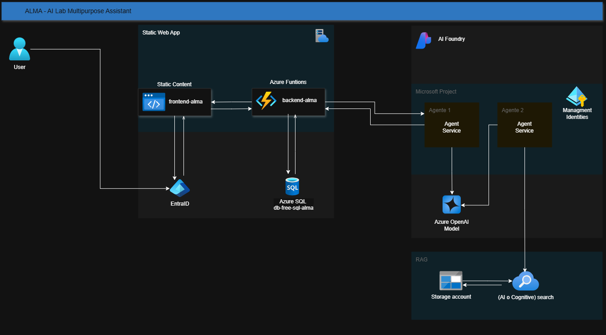

<!-- HEADER -->

# 🤖 ALMA: AI Lab Multipurpose Assistant

## Tabla de contenido

- [Descripcion general](#descripcion-general)
- [Caracteristicas](#caracteristicas)
- [Arquitectura del Sistema](#arquitectura-del-sistema)
- [Tecnologías usadas](#tecnologías-usadas)
- [Recursos Azure Desplegados](#recursos-azure-desplegados)
- [Funcionamiento de la Aplicación](#funcionamiento-de-la-Aplicación)
- [Estrategia de Testeo](#estrategia-de-Testeo)
- [Video Final del Proyecto](#video-Final-del-Proyecto)
- [Guía de Ejecución del Proyecto](#guía-de-ejecución-del-proyecto)
- [Instalación y Configuración](#recursos-azure-desplegados)

## Descripcion general

Sistema de gestión de experimentos científicos con asistencia de IA para acelerar el ciclo de experimentación manteniendo rigor y seguridad.

_Alma_ es un Agente de IA diseñado como un Cuaderno de Laboratorio Digital (ELN) inteligente que actúa como un grafo de conocimiento persistente para la gestión de experimentos científicos. El sistema permite documentar protocolos, registrar observaciones, almacenar resultados y consultar mediante IA todo el conocimiento generado.

En este ejemplo podemos observar el flujo completo de interacción entre el científico y el sistema ALMA:

1. Contexto inicial: El cientifico accede a un experimento existente, demostrando la capacidad de ALMA para mantener el estado y el historial de cada investigación.

1. Captura multimodal: Al arrastrar una imagen y escribir una observación, vemos cómo el sistema integra diferentes tipos de entrada (visual y textual) en un único registro.

1. Procesamiento automático: El OCR sobre la imagen ocurre en segundo plano, liberando al científico de tareas administrativas y garantizando que los datos visuales sean tan buscables como el texto.

1. Consulta conversacional: La pregunta en lenguaje natural activa el agente IA, que no solo responde, sino que razona sobre el contexto específico del experimento.

1. RAG en acción: La respuesta incluye una cita explícita a una fuente indexada, demostrando que el sistema no "alucina", sino que fundamenta sus sugerencias en la base de conocimiento del laboratorio.

1. Persistencia con trazabilidad: Al hacer clic en "Registrar", la recomendación queda guardada en el journal junto con su fuente, creando un rastro auditable de cómo se llegó a cada decisión experimental.

---

## Caracteristicas

Este proyecto propociona a los laboratorios las siguiente caracteristicas:

* **Gestion de exprimentos**: Registro de proyectos y experimientos con una estructura jerarquica
* **Diagrio de laboratorio**: Registro de anotaciones, observaciones y resultado
* **Almacenamientos de Archivos**: Permite subir y gestionar archivos PDFs, imagenes, CSVs
* **Interacion por voz**: Permite a los cientifico registrar e interacturar con el asitente mediante la voz.
* **Procesamiento de Documentos**: OCR para imagenes y extraccion de texto de PDFs
* **Asistente AI**: Chat contextual con capacidad de grounding en documentos del laboratorio
* **Busqueda Semantica**: RAG sobre base de conocimiento 
---

## Arquitectura del Sistema

El proyecto esta compuesto de las siguiente capas y tecnologias.

| **Capa**                   | **Tecnologia**                   | **Descripción** |
| -------------------------- | -------------------------------- | -------------------------------------------------------------------------------------------------------------------------------------------------------------------------------------------------------- 
| Frotend     | Next.js + Tailwind | SPA con panel lateral de chat y visor de documentos|
| Backend API | Azure Function (Python) | Orquestador API y lógica de negocio |
| Base de datos            | Azure SQL (capa gratuita)           | Persistencia relacional de experiementos|
| Almacenamiento              | Azure Blob Storage  | Repositorio de documentos, imagenes y resultados|
| Busqueda vectorial | Azure AI Search | RAG sobre documentos cientificos |
| LLM | GPT-4o-mini | Razonamiento sobre protocolo y resultados |
| Procesamiento | Azure AI Vision | OCR y extraccion de tablas |

---

## Diagrama de la arquitectura

---

## Tecnologías usadas

| **Categoria**                     | **Tecnologia** |
| -------------------------- | -------------------------------- | 
| Cloud         | Azure (Resource Group, Storage Account, SQL Server)                                                          |
| Backend        | Azure Functions (Python) |
| IA/ML | Azure AI Agent Service, Azure AI Search, Azure AI Vision, GPT-4o-mini  |
| Frontend     | React, Bootstrap (por definir)|
| DevOps  | Git, Documentación técnica                                                                                              |

---

## Recursos Azure Desplegados

<!-- |Recurso |	Nombre |	Región |	Propósito |
| -------------------------- | -------------------------------- | -------------------------------- | -------------------------------- | 
|Resource Group |	rg-alma |	East US |	Contenedor principal|
Storage Account |	stalma01 |	East US |	Blob storage para archivos|
SQL Server |	svr-alma-01 |	West US |	Servidor de base de datos |
SQL Database |	db-free-sql-alma |	West US |	Base de datos transaccional |

--- -->

Estrategia de Testeo

Capturas de Pantalla

Video Final del Proyecto

Guía de Ejecución del Proyecto

Instalación y Configuración

